# Introduction

This app uses the Model View Intent (MVI) architecture.

MVI is an architectural pattern that utilizes unidirectional data flow.

In MVI each component can be described as follows;

1. Model - It contains state of the UI. This has various UI states like Loading, Loaded, List Data, Error, etc. The UI just subscribes to these states and never tries to alter them directly.

2. View - Is all the UI related code that binds our states to the various UI components like Activities, Fragements, Composables and other UI components.

3. Intent - This is what describes a user action. This is the only way to communicate with our Model layer so it can process the user action and return a state.

You can see that data only flow in one direction. Intents define the action needed, provided to the Model so it can process the data and produce a state that will be returned to the View and be displayed to the user. It's not so different from MVVM. But with MVI we make sure that a view only displays state and nothing else. We can use ViewModels for process death handling but unlike MVVM they will only contain state provided by Model and won't create state themselves.

MVI is the perfect choice for a Kotlin Multiplatform project as it helps you separate as much code from the UI as possible. You can have native UI on all platform that all consume states provided by MVI without having to do any manipulatio logic on it.

## Orbit MVI

This project uses [Orbit MVI](https://orbit-mvi.org/) for it's MVI implementation.

Obrbit MVI takes a more MVVM approach in MVI instead of the Redux route most other libraries like [MVIKotlin](https://arkivanov.github.io/MVIKotlin/) use.

Orbit MVI while not taking separation on concerns to the extreme like MVIKotlin it let's create your MVI system without a lot of boiler plate code

This makes development using Orbit very quick and does not have such a steep learning curve for developers who have already worked with MVVM before.

### Structure

Orbit MVI works as follows:

1. UI invokes functions on a class implementing the ContainerHost interface like [this](https://github.com/Thinkrchive/Thinkrchive-Multiplatform/blob/main/common/integration/src/commonMain/kotlin/work.racka.thinkrchive.v2.common.integration/containers/list/ThinkpadListContainerHost.kt). Typically in Android this might be an Activity, Fragment or a simple View. However, an Orbit system can also be run without any UI, for example as a background service.

2. The functions call through to a Container instance through the `intent` block which offloads work to a background coroutine and provides a DSL for side effects and reductions.

3. Transformations are performed through user-defined business logic within the `intent` block.

4. The reduce operator reduces the current state of the system with the incoming events to produce new states.

5. The new state is sent to observers.

***Source: [Orbit MVI docs](https://orbit-mvi.org/Core/architecture)***

On top of providing states, Orbit MVI also has the concept of ***Side Effects***
Side effects are one time events that are fired when a certain `intent` produces something that is not directly mapped to the state. A side effect can be something like showing a Toast, Navigating to another page, Error/Loading Indicators when indirectly accessing Network calls, etc.

You can leverage the power of side effects to make calls to things that are not directly related to UI state. These should not post back any events to the UI.

:::tip Example
When you save a `Theme` property in Settings you will provide `state` to the UI to update the user and show them what `Theme` they have selected. But to change the `Theme` you can post a `side effect` that will change the App `Theme` when the user selects a new `Theme`. This is not directly mapped to `UI state` and hence is a `side effect`.
:::

## Project Structure

